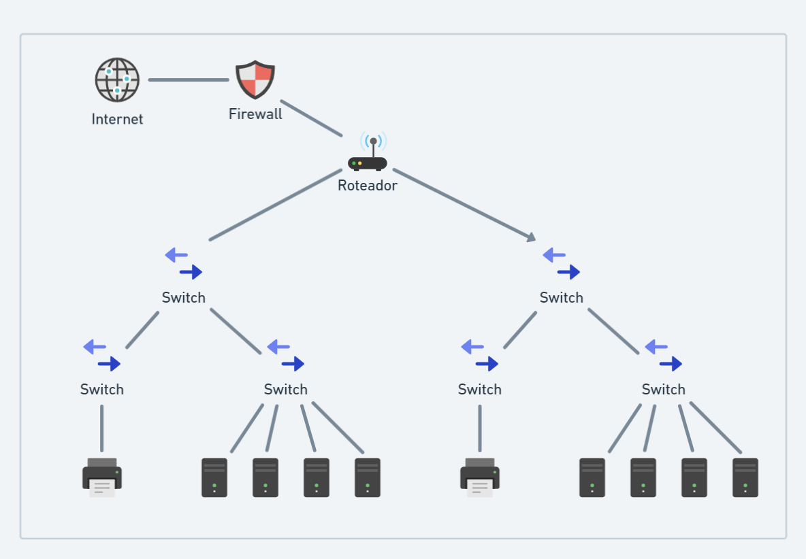

# Projeto Hierarquico

> O seguinte projeto busca compreender um estudo de caso estabelecendo uma metologia "top-down", buscando avaliar seus pontos positivos e negativos, assim como também criar um modelo que represente o problema proposto.

#### Restruturação
> O ambiente que desejamos fazer uma restruturação encontra-se em expansão. Portanto, encontramos nesta rede vários dispositivos, como impressoras, telefones ...etc. Sendo assim, admitimos que a atual arquitetura possue falhas por todos os dispositivos e sua distribuições se encontrarem no mesmo segmento.

> A seguinte estrutura busca primeiramente busca separar os dispositivos em dois segmentos, um para os dispositivos de escritório (impressoras) e outro para os dispositivos de produção (computadores). Sendo assim, a rede de produção será separada da rede de escritório, assim como também a rede de produção será separada da rede de produção.

> Entende-se que a rede de produção é a rede que possui maior importância, pois é a rede que possui os computadores que realizam as tarefas mais importantes da empresa. Sendo assim, a rede de produção será a rede que receberá maior atenção, pois é a rede que possui maior risco de falhas.

> A rede de escritório será a rede que receberá menor atenção, pois é a rede que possui menor risco de falhas, pois é a rede que possui os dispositivos que realizam tarefas menos importantes da empresa.

> Outro ponto importante, é que a rede de produção possui um servidor que realiza a função de DHCP, assim como também possui um servidor que realiza a função de DNS. Sendo assim, a rede de produção possui um servidor que realiza a função de DHCP e DNS, enquanto a rede de escritório não possui nenhum servidor que realiza a função de DHCP e DNS. Sua configuração é feita manualmente.

# Pontos Negativos da Rede

> Na rede não existe nenhum padrão na identificação dos equipamentos, a manutenção e a escalabilidade acaba sendo mais dificil por conta disso. Existe vários tipos de dispositivos diferentes na mesma rede, não existe nenhum tipo de isolamento para segurança. Os switches com as mesmas especificações pode acarretar uma limitação de tráfego e sobrecarga na rede.

# Pontos Positivos da Rede

> Contém camadas de núcleo, distribuição e acesso. Todos os dispositivos são atualizados, não existe nenhum dispositivo ultrapassado como o Hub. Na rede tem um firewall que previne falhas e ataques.

# Sugestão de Rede

#### Nomenclatura:

> Tipo do Equipamento - Local - Código do Local - Unidade
